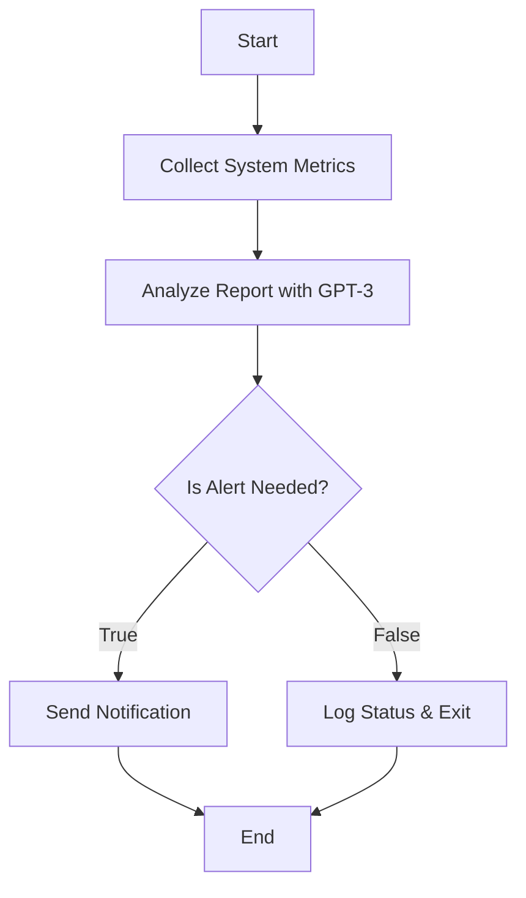

# Pi Agent - reporting the health of your Raspberry Pi via GPT

- collect system information via:
   - mpstat -o JSON
   - df -h
   - free -h
   - pgrep -f octoprint
   - vcgencmd measure_temp
 - ask GPT what to make of this and wether to raise an alarm
 - send notification via Pushover

