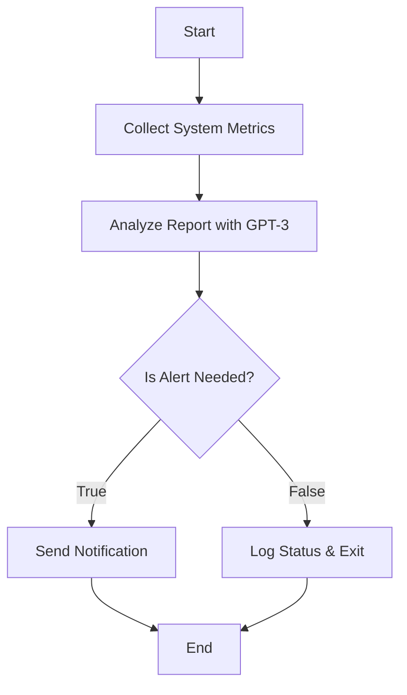

# Pi Agent - reporting the health of your Raspberry Pi via GPT

```mermaid
flowchart TD 
A[Start] --> B[Collect System Metrics]
B --> D[Analyze Report with GPT-3]
D --> F{Is Alert Needed?}
F -->|True|G[Send Notification]
F -->|False|H[Log Status & Exit] 
G --> I[End] 
H --> I
```

